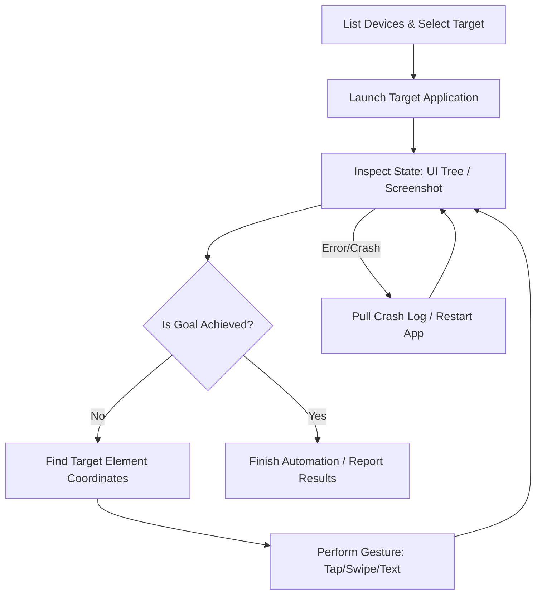

# Mobile CLI

A universal automation and management skill for iOS and Android devices, simulators, emulators, and mobile apps. This skill guides you through interacting with devices, automating applications, performing gestures, capturing screen states, inspecting webviews, and interacting with the `mobilecli` command-line interface and background JSON-RPC server.

---

## 📖 Table of Contents
1. [Prerequisites & Server Setup](#prerequisites--server-setup)
2. [AI Automation Workflows](#ai-automation-workflows)
3. [Command Reference (CLI)](#command-reference-cli)
4. [JSON-RPC Server & WebSocket API](#json-rpc-server--websocket-api)
   - [Core JSON-RPC API Examples](#core-json-rpc-api-examples)
   - [Custom Gestures (JSON-RPC only)](#custom-gestures-json-rpc-only)
   - [Filesystem Limits in JSON-RPC](#filesystem-limits-in-json-rpc)
5. [Platform-Specific Notes & Troubleshooting](#platform-specific-notes--troubleshooting)
6. [Best Practices for AI Agents](#best-practices-for-ai-agents)

---

## 🛠 Prerequisites & Server Setup

Before using this skill, ensure the environment has the necessary prerequisites installed and configured:

- **Android SDK**: `adb` must be available in the system `PATH`.
- **Xcode Command Line Tools**: Required for iOS Simulator control (on macOS).
- **On-Device Agent**: Required for iOS input gestures, screenshots, and UI dumping, and for Android non-ASCII text input.

### Run instantly with npx
If `mobilecli` is not installed globally, you can invoke any command using `npx`:
```bash
npx mobilecli@latest <command>
```

### Starting and Stopping the JSON-RPC Daemon (Recommended)
Starting the HTTP server is highly recommended for automated scripts and fast interactions. It caches device information, keeps connections/tunnels alive, and eliminates command-line startup overhead.

```bash
# Start server in the foreground (defaults to localhost:12000)
mobilecli server start --listen localhost:12000 --cors

# Start server in the background (daemon mode)
mobilecli server start --listen localhost:12000 --cors --daemon

# Stop a background daemon server
mobilecli server kill --listen localhost:12000
```

---

## 🔄 AI Automation Workflows

When executing mobile automation or app testing, follow this structured loop:



1. **Find & Target Device**: Run `mobilecli devices` to see online devices and simulators. If only one device is online, it is automatically selected; otherwise, pass the device ID to the `--device <id>` flag.
2. **Launch App**: Use `mobilecli apps launch <bundle-id>` to bring the target application to the foreground.
3. **Capture State**:
   - Dump the UI tree: `mobilecli dump ui` to locate elements programmatically.
   - Take a screenshot: `mobilecli screenshot` to visually confirm what is displayed.
4. **Interact**: Locate your target element in the UI dump, calculate its center coordinates, and trigger inputs (e.g. `mobilecli io tap`, `mobilecli io text`).
5. **Repeat or Debug**: Verify the changes in a new UI dump or screenshot, handle popups, and check crash reports if the app terminates.

---

## 💻 Command Reference (CLI)

All commands support the global `--device <id>` flag to specify the target device, and `-v` / `--verbose` for logging.

### 1. Device Lifecycle & Info
* **List Devices**:
  ```bash
  # List online devices
  mobilecli devices
  
  # List all devices including offline ones
  mobilecli devices --include-offline
  ```
* **Boot Device** (start an offline simulator or emulator):
  ```bash
  mobilecli device boot --device <device-id>
  ```
* **Shutdown / Reboot**:
  ```bash
  mobilecli device shutdown --device <device-id>
  mobilecli device reboot --device <device-id>
  ```
* **Device Information**:
  ```bash
  mobilecli device info --device <device-id>
  ```
* **Orientation Control**:
  ```bash
  # Get current orientation (portrait/landscape)
  mobilecli device orientation get --device <device-id>
  
  # Set orientation
  mobilecli device orientation set --device <device-id> landscape
  ```

### 2. App Management
* **List Apps**:
  ```bash
  mobilecli apps list --device <device-id>
  ```
* **Foreground App**:
  ```bash
  mobilecli apps foreground --device <device-id>
  ```
* **Launch / Terminate**:
  ```bash
  mobilecli apps launch <bundle-id> --device <device-id>
  mobilecli apps terminate <bundle-id> --device <device-id>
  ```
* **Install / Uninstall**:
  ```bash
  # Installs .apk (Android), .ipa (iOS Real), or .zip (iOS Simulator)
  mobilecli apps install /path/to/app.apk --device <device-id>
  
  # Uninstall
  mobilecli apps uninstall <bundle-id> --device <device-id>
  ```

### 3. Screen & Media
* **Take Screenshot**:
  ```bash
  # PNG format (default)
  mobilecli screenshot --device <device-id> --output screenshot.png
  
  # JPEG with quality control
  mobilecli screenshot --device <device-id> --format jpeg --quality 80 --output screenshot.jpg
  ```
* **Record Screen**:
  ```bash
  # Record screen to MP4 file
  mobilecli screenrecord --device <device-id> --output recording.mp4
  
  # Record with custom time limit (in seconds) and suppress progress output
  mobilecli screenrecord --device <device-id> --output recording.mp4 --time-limit 15 --silent
  ```

### 4. Input & Gestures
* **Tap Coordinates**:
  ```bash
  mobilecli io tap --device <device-id> 150,300
  ```
* **Long Press**:
  ```bash
  mobilecli io longpress --device <device-id> 150,300 --duration 2000
  ```
* **Swipe**:
  ```bash
  # Swipe from x1,y1 to x2,y2
  mobilecli io swipe --device <device-id> 100,600,100,200
  ```
* **Send Text**:
  ```bash
  # Types text into the currently focused input field
  mobilecli io text --device <device-id> "John Doe"
  ```
* **Hardware Buttons**:
  ```bash
  # Press buttons: HOME, BACK (Android only), POWER, VOLUME_UP, VOLUME_DOWN
  mobilecli io button --device <device-id> HOME
  ```

### 5. UI Inspection & Webviews
* **Dump UI Tree**:
  ```bash
  # Parsed JSON format
  mobilecli dump ui --device <device-id>
  
  # Raw XML/JSON source from agent
  mobilecli dump ui --device <device-id> --format raw
  ```
* **List Webviews**:
  ```bash
  mobilecli webview list --device <device-id>
  ```
* **Webview Navigation & Query**:
  ```bash
  # Navigate to a URL
  mobilecli webview goto <webview-id> https://example.com --device <device-id>
  
  # Query DOM elements via CSS selector
  mobilecli webview query <webview-id> "button.submit-btn" --device <device-id>
  
  # Dump full outer HTML
  mobilecli webview content <webview-id> --device <device-id>
  ```
* **Evaluate JavaScript**:
  ```bash
  mobilecli webview eval <webview-id> "document.title" --device <device-id>
  ```
* **Wait for Load State**:
  ```bash
  # Wait states: "load" or "domcontentloaded"
  mobilecli webview wait <webview-id> --state domcontentloaded --timeout 5000 --device <device-id>
  ```

### 6. Filesystem Operations
Access files on-device or inside debuggable app private directories (Android and iOS Simulator).
* **List Directory**:
  ```bash
  # Absolute path
  mobilecli fs ls --device <device-id> /sdcard/Download
  
  # App private container path
  mobilecli fs ls --device <device-id> com.example.app /Documents
  ```
* **Transfer Files**:
  ```bash
  # Push local file to device
  mobilecli fs push --device <device-id> ./config.json /sdcard/config.json
  
  # Pull remote file to host
  mobilecli fs pull --device <device-id> /sdcard/log.txt ./log.txt
  ```
* **Directories & Deletion**:
  ```bash
  # Create directory
  mobilecli fs mkdir --device <device-id> -p /sdcard/newdir
  
  # Delete file or directory
  mobilecli fs rm --device <device-id> -r /sdcard/newdir
  ```

### 7. Crash Logs & Deep Linking
* **Deep Links**:
  ```bash
  mobilecli url --device <device-id> "myapp://settings?user=123"
  ```
* **Crash Reports**:
  ```bash
  # List crash logs
  mobilecli device crashes list --device <device-id>
  
  # Get crash report content
  mobilecli device crashes get <crash-id> --device <device-id>
  ```

---

## 🔌 JSON-RPC Server & WebSocket API

For scripts and long-running automation, make HTTP POST requests to the server's endpoint (`http://localhost:12000/rpc`). The JSON-RPC payload format is:
`{"jsonrpc": "2.0", "method": "<method_name>", "params": { ... }, "id": 1}`

### Core JSON-RPC API Examples

* **List Devices**:
  ```bash
  curl http://localhost:12000/rpc -X POST -H "Content-Type: application/json" \
    -d '{"jsonrpc":"2.0", "id": 1, "method": "devices.list", "params": {}}'
  ```
* **Take Crop/Clip Screenshot**:
  ```bash
  curl http://localhost:12000/rpc -X POST -H "Content-Type: application/json" \
    -d '{"jsonrpc":"2.0", "id": 2, "method": "device.screenshot", "params": {"deviceId": "device-id", "format": "png", "clip": {"x": 50, "y": 100, "width": 200, "height": 300}}}'
  ```
* **Stop Server Remotely**:
  ```bash
  curl http://localhost:12000/rpc -X POST -H "Content-Type: application/json" \
    -d '{"jsonrpc":"2.0", "id": 3, "method": "server.shutdown", "params": {}}'
  ```

### Custom Gestures (JSON-RPC only)
For complex multi-action interactions (e.g. dragging, pinching, or specific curves) which are not accessible via standard CLI gestures, use the `device.io.gesture` method. This allows you to chain raw pointer motion events.

Supported actions:
- `pointerDown`: Touches screen at the current x,y coordinate.
- `pointerMove`: Moves coordinates to target `x`, `y`.
- `pointerUp`: Lifts pointer off screen.
- `pause`: Sleeps for `duration` (in milliseconds).

**Example: Drag-and-Drop Action**
```json
{
  "jsonrpc": "2.0",
  "id": 1,
  "method": "device.io.gesture",
  "params": {
    "deviceId": "my-device-id",
    "actions": [
      { "type": "pointerMove", "x": 100, "y": 150 },
      { "type": "pointerDown" },
      { "type": "pause", "duration": 500 },
      { "type": "pointerMove", "x": 300, "y": 450 },
      { "type": "pause", "duration": 200 },
      { "type": "pointerUp" }
    ]
  }
}
```

### Filesystem Limits in JSON-RPC
> [!WARNING]
> **1MB RPC payload limit**: The JSON-RPC calls `device.fs.push` and `device.fs.pull` encode file data using Base64. To maintain server performance, the maximum file size supported by these RPC endpoints is **1 MB**.
> 
> If you need to transfer databases, video files, or payloads larger than 1 MB, you must bypass the JSON-RPC endpoints and invoke the CLI commands directly (`mobilecli fs push` / `mobilecli fs pull`), which handle raw streams and are binary-safe for large volumes.

### WebSocket API
You can open a persistent connection to `ws://localhost:12000/ws` using tools like `wscat`:
```bash
wscat -c ws://localhost:12000/ws
> {"jsonrpc":"2.0","id":1,"method":"devices.list","params":{}}
< {"jsonrpc":"2.0","id":1,"result":[...]}
```

---

## 🍎 Platform-Specific Notes & Troubleshooting

### iOS Real Devices
- **Agent Dependency**: Input gestures, screenshots, and UI dumps require the agent. Install it via:
  ```bash
  mobilecli agent install --device <device-id> --provisioning-profile /path/to/profile.mobileprovision
  ```
  A valid Apple Provisioning Profile and signing identity must be present on the host to code-sign the agent.

### Android Real Devices & Emulators
- **ADB Access**: Ensure the device has "USB Debugging" enabled.
- **App Private Container Paths**: Android app containers (`/data/user/0/...`) are accessed using `run-as`, which requires the application to be built as **debuggable** (`android:debuggable="true"` in the manifest).

### iOS Simulator
- Crash logs are read directly from `~/Library/Logs/DiagnosticReports/`.

---

## 💡 Best Practices for AI Agents

> [!TIP]
> **Use the JSON-RPC server whenever possible**: Invoking `mobilecli` via subprocess CLI commands incurs Go binary startup latency each time. Starting the server and querying it over HTTP/WebSocket speeds up interactions from seconds to milliseconds.

> [!IMPORTANT]
> **Tap coordinates must target the center of the bounding box**:
> When parsing a UI element from `mobilecli dump ui`, locate the element's `rect` (`x`, `y`, `width`, `height`). Calculate the center coordinates:
> $$\text{Center X} = x + \frac{\text{width}}{2}$$
> $$\text{Center Y} = y + \frac{\text{height}}{2}$$
> Send this center point to `mobilecli io tap --device <device-id> <CenterX>,<CenterY>`.

> [!NOTE]
> **Interact with input fields before writing text**:
> To write text into a text field, first trigger a tap on the center of that text field to focus it, wait a few hundred milliseconds for the soft keyboard to appear, and then call `mobilecli io text`.

> [!WARNING]
> **Auto-selection caveat**:
> While `mobilecli` auto-selects the target device when only *one* online device is connected, always verify the list of connected devices first. If multiple devices are online, you must pass the exact device ID to avoid command failures.
