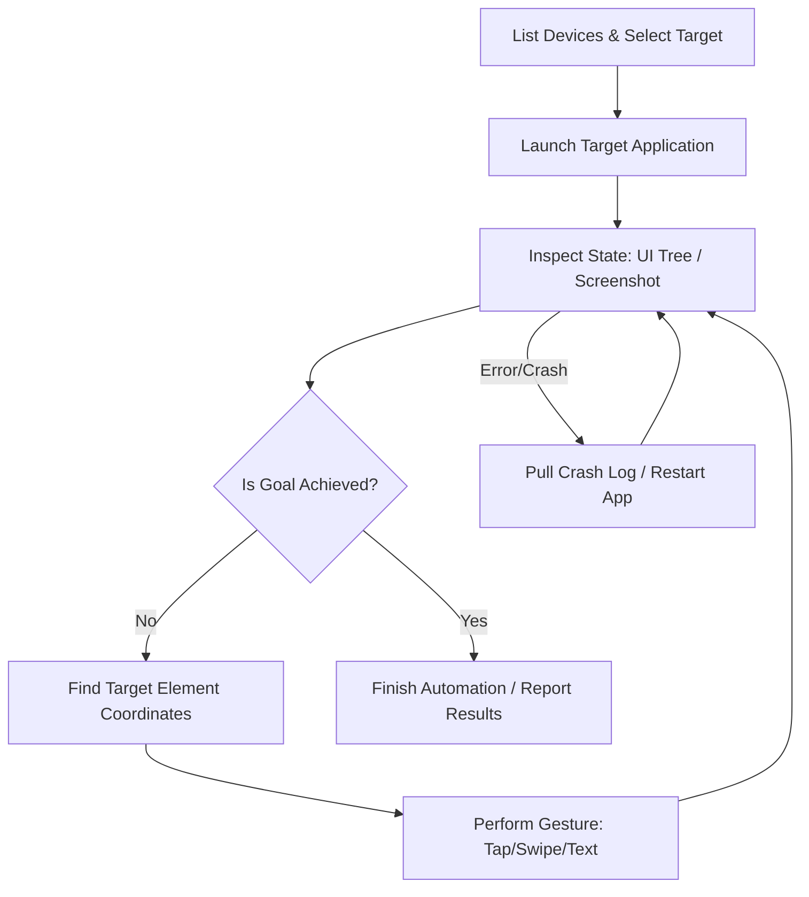

# Mobile CLI

A universal automation and management skill for iOS and Android devices, simulators, emulators, and mobile apps. This skill guides you through interacting with devices, automating applications, performing gestures, capturing screen states, inspecting webviews, using the `mobilecli` command-line interface.

---

## Install

Before the first device command, make sure the `mobilecli` binary exists. If it is missing, install it globally with npm. No need to ask the user first; installing is expected.

```bash
command -v mobilecli >/dev/null || npm install -g mobilecli@latest
mobilecli --version
```

If `npm install -g` fails with a permissions error, retry with `sudo npm install -g mobilecli@latest` or ask the user. If `mobilecli` is not on the agent's PATH but the user says it is installed, run `npm bin -g` (or `npm prefix -g`) and use the binary from there.

Do not run `npx mobilecli@latest` for every command; it re-resolves the package each time and makes automation slow.

Every device command talks to a background daemon (auto-started, exits after 30 idle minutes; `mobilecli daemon status|stop`). Nothing to set up.

Platform prerequisites (already covered if the user has been using devices on this machine):
- Android: `adb` on PATH (`brew install --cask android-platform-tools`).
- iOS simulators: Xcode with a booted simulator.

---

## Quick Start (TL;DR)

Start working immediately. Do not probe with `--help` or `--version` first.

```bash
# 1. List devices and note the device id. This starts the background daemon,
#    which keeps devices, tunnels and agents alive so following commands are fast.
mobilecli devices

# 2. Boot the target device (only if offline)
mobilecli device boot --device <device-id>

# 3. Launch the app and dump the UI in one go. Every element gets a ref like @e5.
mobilecli apps launch com.example.myapp --device <device-id> && \
  mobilecli dump ui --device <device-id> --format text

# 4. Act on a ref, then re-dump to verify. Chain with && so one bash call does both.
mobilecli io tap @e5 --device <device-id> && \
  mobilecli dump ui --device <device-id> --format text

# 5. Confirm visually when needed
mobilecli screenshot --device <device-id> --output screenshot.png
```

### Chaining commands

Each `mobilecli` invocation is a separate process, so chain related steps with `&&` in a single bash call. `&&` stops the chain on the first failure, which is what you want in automation:

```bash
# fill a login form and check the result with one bash call
mobilecli io tap @e3 --device <id> && mobilecli io text "user@example.com" --device <id> && \
mobilecli io tap @e4 --device <id> && mobilecli io text "secret" --device <id> && \
mobilecli io tap @e7 --device <id> && sleep 1 && mobilecli dump ui --device <id> --format text
```

Refs (`@e1`, `@e2`, ...) are numbered by the most recent `dump ui`. Any tap, text entry, or navigation can change the tree, so re-dump before reusing a ref. Prefer `--format text` for reading, and the default JSON when you need `rect` coordinates or need to script over the output.

---

## AI Automation Workflows

When executing mobile automation or app testing, follow this structured loop:


```mermaid
graph TD
    A[List Devices & Select Target] --> B[Launch Target Application]
    B --> C[Inspect State: UI Tree / Screenshot]
    C --> D{Is Goal Achieved?}
    D -- No --> E[Find Target Element Coordinates]
    E --> F[Perform Gesture: Tap/Swipe/Text]
    F --> C
    D -- Yes --> G[Finish Automation / Report Results]
    C -- Error/Crash --> H[Pull Crash Log / Restart App]
    H --> C
```

1. **Find & Target Device**: Run `mobilecli devices` to see online devices and simulators. If only one device is online, it is automatically selected; otherwise, pass the device ID to the `--device <id>` flag.
2. **Launch App**: Use `mobilecli apps launch <bundle-id>` to bring the target application to the foreground.
3. **Capture State**:
   - Dump the UI tree: `mobilecli dump ui` to locate elements programmatically.
   - Take a screenshot: `mobilecli screenshot` to visually confirm what is displayed.
4. **Interact**: Tap the element's ref from the dump (`mobilecli io tap @e5`), or compute the center of its `rect` and tap `x,y`. Then `mobilecli io text` for input.
5. **Repeat or Debug**: Verify the changes in a new UI dump or screenshot, handle popups, and check crash reports if the app terminates.

---

## Best Practices for AI Agents

> [!IMPORTANT]
> **Prefer refs over coordinates**:
> `mobilecli io tap @e5` taps the center of element 5 from the latest `dump ui`. Only fall back to coordinates when you need a point that is not an element (e.g. swipe start/end). If you do, use the center of the element's `rect`: `centerX = x + width/2`, `centerY = y + height/2`. Refs are invalidated by any UI change, so re-dump before reusing them.

> [!TIP]
> **Chain steps with `&&`**:
> Run action + verification in one bash call: `mobilecli io tap @e5 --device <id> && mobilecli dump ui --device <id> --format text`. Fewer round-trips, and the chain stops at the first failing step.

> [!WARNING]
> **Release remote devices**:
> Remote devices from Mobile Next Cloud stay allocated (and billed) until `mobilecli remote release --device <id>` runs. Release them at the end of the task, including on failure. Know that there is a 5 minutes minimum, so do not release a device until you are really done with it.

> [!NOTE]
> **Interact with input fields before writing text**:
> To write text into a text field, first trigger a tap on the center of that text field to focus it, wait a few hundred milliseconds for the soft keyboard to appear, and then call `mobilecli io text`.

> [!WARNING]
> **Auto-selection caveat**:
> While `mobilecli` auto-selects the target device when only *one* online device is connected, always verify the list of connected devices first. If multiple devices are online, you must pass the exact device ID to avoid command failures.

---

## Quick Interaction Reference

Here is a quick reference table mapping standard user actions to `mobilecli` commands:

| User Action | CLI Command | Description |
| :--- | :--- | :--- |
| **Tap** | `mobilecli io tap @e5` or `mobilecli io tap <x,y>` | Single touch on a ref from `dump ui`, or at coordinates |
| **Long Press** | `mobilecli io longpress <x,y> --duration <ms>` | Press and hold for a duration |
| **Swipe** | `mobilecli io swipe <x1,y1,x2,y2>` | Drag from start to end coordinates |
| **Pinch** | `mobilecli io pinch [x,y] --direction in\|out` | Two-finger zoom out (`in`) or in (`out`), around x,y or the screen center |
| **Type Text** | `mobilecli io text "<text>"` | Send raw text to the focused field |
| **Key Press** | `mobilecli io button <BUTTON_NAME>` | Press hardware buttons (e.g. HOME, POWER) |
| **Read Clipboard** | `mobilecli io clipboard get` | Read text from the device clipboard |
| **Write Clipboard** | `mobilecli io clipboard set "<text>"` | Replace text on the device clipboard |

---

## Remote Devices (Mobile Next Cloud)

Real iOS and Android devices hosted by Mobile Next. Once allocated, a remote device shows up in `mobilecli devices` with `"type": "remote"` and every command above works on it unchanged via `--device <id>`.

### 1. Authenticate once

```bash
# device-code flow: prints a URL and a code for the user to enter in a browser.
# the user must do this step; it cannot be completed by the agent.
mobilecli auth login

# headless hosts with no OS keyring
mobilecli auth login --insecure-storage

# verify
mobilecli auth token
```

Token lookup order: `MOBILECLI_TOKEN` env var, then the OS keyring (or the credentials file with `--insecure-storage`). In CI, set `MOBILECLI_TOKEN` instead of logging in. Not logged in and no token means every `remote` command fails; ask the user to run `mobilecli auth login`.

### 2. Allocate, use, release

```bash
# see what the fleet has
mobilecli remote list-devices

# allocate and block until the device is ready (default timeout 900s)
mobilecli remote allocate --platform ios --version ">=18" --name "iPhone*" --wait
mobilecli remote allocate --platform android --version 14 --wait

# the response includes the device id; from here it is a normal device
mobilecli devices
mobilecli apps install ./app.ipa --device <remote-id> && \
  mobilecli apps launch com.example.app --device <remote-id> && \
  mobilecli dump ui --device <remote-id> --format text

# always release when done, devices are billed while allocated
mobilecli remote release --device <remote-id>
```

Filters: `--platform ios|android`, `--version` (repeatable, ANDed, supports `>=`, `>`, `<=`, `<`, or exact), `--name` (exact or trailing `*` prefix). Always pass `--wait`; without it the command returns while the device is still `allocating`.

---

---

## Full reference

Every other command (apps, screen recording, swipe/longpress/buttons, clipboard, webviews, filesystem, crash reports, device logs, deep links, orientation), platform quirks, and the JSON-RPC/WebSocket API are in [reference.md](reference.md). `mobilecli <command> --help` is always current.
